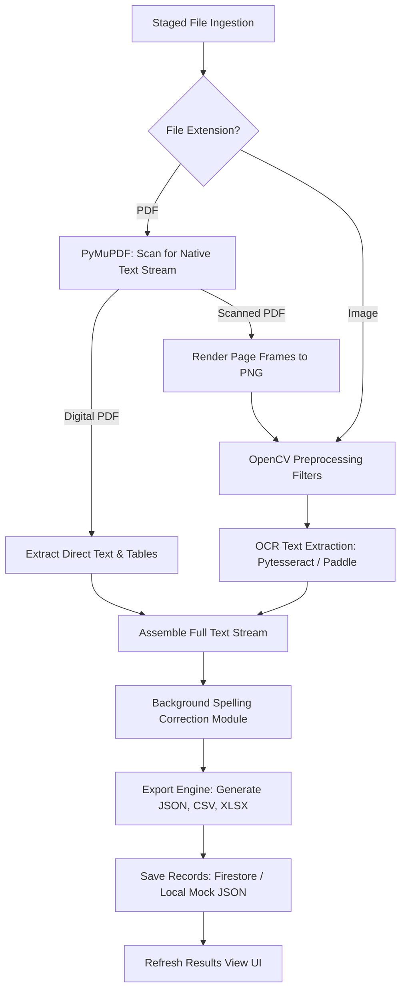

# PATRANET: Intelligent Document Processing Platform
## Technical Architecture & Implementation Documentation

This document outlines the detailed system design, dependencies, pipeline mechanics, and engineering decisions implemented in the **PATRANET** Document Processing Suite.

---

## 1. Core Technology Stack (What We Used & Why)

| Technology | Role | Why We Selected It |
| :--- | :--- | :--- |
| **Streamlit** | Frontend & Orchestration | Enables rapid creation of reactive UI dashboards in pure Python. Eliminates frontend/backend boilerplate, matching tight hackathon deadlines. |
| **PyMuPDF (`fitz`)** | PDF Parsing & Image Rendering | Extremely high-speed C-backed PDF engine. Used to extract native text streams directly (100% accuracy) and render PDF pages into images for OCR. |
| **Tesseract OCR (`pytesseract`)** | Text Recognition & Handwriting Parsing | Highly portable OCR engine. Leverages system-level binary integration to parse handwritings and scanned document layouts when heavy GPU models like PaddlePaddle are unavailable. |
| **OpenCV (`cv2`)** | Image Preprocessing & Filtering | Applied to clean, binarize, and enhance images before OCR. Removes paper shadows, gradients, and lines, significantly raising Tesseract's character recognition scores. |
| **pdfplumber** | Table Structure Detection | Reads PDF vector paths to identify lines and coordinates, preserving row-and-column alignments when parsing tables into Pandas DataFrames. |
| **Pandas & openpyxl** | Data Normalization & Formatting | Pandas structures tables into DataFrames. Openpyxl compiles multiple sheets (Overview, Table 1, Table 2) into native Excel files. |
| **Firebase SDK / Mock DB** | Data Synchronization & Storage | Designed with a dual-mode service layer. Operates on Cloud Firestore & Storage when credentials exist, but falls back to offline JSON databases and local folders to ensure zero-setup testing. |

---

## 2. System Architecture & Folder Directory

```
PATRANET/
│
├── app.py                      # Main landing page & session states
├── requirements.txt            # Python library declarations
├── packages.txt                # Streamlit Cloud Linux system dependencies (Tesseract)
├── ARCHITECTURE.md             # This technical manual
│
├── core/
│   ├── ocr_engine.py           # Multi-engine OCR manager (Paddle / Tesseract / Mock)
│   ├── pdf_processor.py        # Master ingestion pipeline driver
│   ├── table_extractor.py      # Tabular boundary parsing wrapper
│   ├── image_extractor.py      # Embedded media siphoner (PyMuPDF)
│   ├── image_preprocessor.py   # OpenCV binarization & scaling filters
│   ├── spelling_corrector.py   # OCR background spelling auto-corrector
│   └── style_config.py         # Unified style themes and CSS properties
│
├── firebase/
│   ├── firebase_config.py      # SDK Initializer (with local sandbox toggles)
│   ├── storage_service.py      # File & media storage abstraction
│   └── firestore_service.py    # Metadata & document database helper
│
└── storage/
    ├── uploads/                # Cached upload documents
    ├── outputs/                # Generated JSON, CSV, and XLSX files
    └── images/                 # Rendered page frames & isolated PDF assets
```

---

## 3. Detailed Data Pipeline (How It Works)

When a file (PDF or Image) is uploaded to the **Document Upload Center**, the system triggers the following sequential pipeline:



### Detailed Pipeline Stages:
1. **Ingestion & Storage Routing**:
   - The file is cached locally in `storage/uploads/` and uploaded to the Storage Bucket (`storage_service.py`).
2. **Structural Routing**:
   - If the file is a **digital PDF**, `pdf_processor.py` uses PyMuPDF to extract text directly from the digital character stream. This is 100% accurate and processes in milliseconds.
   - If the file has no native text (a **scanned document**), PyMuPDF renders the page to a high-resolution PNG image (150 DPI).
3. **OpenCV Image Enhancement (`image_preprocessor.py`)**:
   - Scales small images up using Cubic Interpolation.
   - Applies **Gaussian Blur** to remove scanning noise.
   - Applies **Otsu's Adaptive Thresholding (Binarization)** to convert all paper gradients, shadows, and colored elements into high-contrast black-on-white lines.
4. **Character Recognition (`ocr_engine.py`)**:
   - The enhanced image is passed to `pytesseract` (Tesseract OCR), which maps the pixel grids to character blocks.
5. **Background Spelling Correction (`spelling_corrector.py`)**:
   - The raw output text contains typical OCR character substitution errors (like `bxown` or `Lay`).
   - The text is passed to the corrector, which performs cleanups using a custom visual-error mapping dictionary first, followed by a distance check using the `pyspellchecker` English database.
6. **Export Compilation (`export_engine.py`)**:
   - Tables extracted via `pdfplumber` are converted to Pandas DataFrames.
   - The Export Engine compiles a real JSON structure, a CSV database file, and a multi-sheet Microsoft Excel (`.xlsx`) workbook containing the metadata, text stream, and separate sheets for every parsed table.
7. **UI Telemetry Refresh**:
   - Document summaries are saved to the datastore. The Dashboard and History modules query this datastore, updating all metrics and grids automatically.

---

## 4. Engineering Trade-offs & Custom Design Decisions

* **Circular Import Prevention**:
  Streamlit subpages execute from top-to-bottom. Placing styling properties directly in `app.py` and importing them in subpages caused Streamlit to reload the main landing file, resulting in crashes. Centralizing the layout CSS under `core/style_config.py` resolved this.
* **Dual-Mode Firebase Integration**:
  To ensure the platform works out-of-the-box on Streamlit Cloud without billing plans or credentials configuration, the configuration checks for the key file. If missing, it swaps Firebase commands for local JSON arrays (`mock_documents.json`) and disk files, keeping the application 100% free and functional.
* **Tesseract System Package Bindings**:
  Since deep learning OCR packages require large binary frameworks (like PyTorch or C++ dependencies) that fail to build on Streamlit Cloud, we configured `packages.txt` to trigger Linux-level installation of Tesseract binary packages, resulting in stable cloud OCR functionality.
